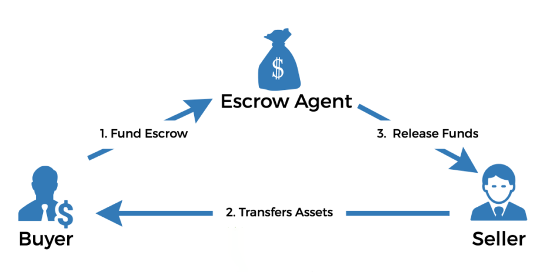

## 第 2 课：构建托管智能合约

### 课程总结：

- 托管智能合约消除了对传统第三方中介机构的需求。

- 智能合约被编码在区块链中，使其安全、透明和防篡改。

- 参与者学习使用区块链编程语言构建托管智能合约。

- 在区块链平台上测试和部署托管智能合约是我们课程的一个重要方面。

### 课程目标：

在课程结束时，你会学习到：

- 了解托管智能合约的概念及其运作方式。

- 获得构建托管智能合约的实践经验。

- 使用自己的函数读取程序状态。

- 了解如何测试托管智能合约

### 让我们开始吧！

托管是第三方临时持有交易资产的约定。资产保存在第三方账户中，只有在满足所有协议条款后才会释放。在交易中使用托管账户为双方增加了安全性。



将托管智能合约编码到区块链中，可以在没有传统第三方的情况下安全地执行合约。

智能合约中的托管如何运作

1. 买方和卖方同意托管条款。卖方列出待售物品，买方支付商定的价格。

2. 卖方交付产品，资金保存在托管智能合约中，直到满足所有条件且买方确认收到产品。

3. 一旦买家认可产品，资金将通过智能合约自动转入卖家的数字钱包。

### 托管项目编码实践

让我们使用以下命令创建一个新项目：

```
cargo new escrow --lib
```

我们需要将必要的依赖项添加到 `Cargo.toml` 文件并创建一个 `build.rs` 文件（类似于 hello-world 课程）。

程序必须存储多个状态才能正确执行逻辑。这些状态包括买卖双方的地址、产品价格和交易状态。

1. `AwaitingPayment`：卖家列出了待售商品，但买家尚未付款；

2. `AwaitingDelivery`：买家将资金转入到智能合约，卖家发货；

3. `Closed`：买家确认发货，卖家收到款项。

在枚举中定义这些状态：

```rust
enum EscrowState {
    AwaitingPayment,
    AwaitingDelivery,
    Closed,
}
```

接下来，让我们定义存储所有必要状态的结构：

```rust
struct Escrow {
    seller: ActorId,
    buyer: ActorId,
    price: u128,
    state: EscrowState,
}
```

我们还需要一个全局变量，它将在合约执行期间发生变化。我们将使用 `static mut` 结构来实现这一点：

```rust
static mut ESCROW: Option<Escrow> = None;
```

在程序初始化之前，ESCROW 值等于 None。在初始化的时候，我们会用信息填充 Escrow 结构，ESCROW 会变成 `Some(Escrow)`。

这是具有最小 Gear 智能合约结构的完整代码：

```rust
#![no_std]
use gstd::{msg, ActorId, prelude::*};

enum EscrowState {
    AwaitingPayment,
    AwaitingDelivery,
    Closed,
}

struct Escrow {
    seller: ActorId,
    buyer: ActorId,
    price: u128,
    state: EscrowState,
}

static mut ESCROW: Option<Escrow> = None;

#[no_mangle]
unsafe extern "C" fn handle () {}

#[no_mangle]
unsafe extern "C" fn init () {}
```

使用 `cargo build --release` 命令构建项目并确保一切正常。

然后我们将描述和编写 `init` 函数。

让我们定义将在初始化期间发送的 `InitEscrow` 消息负载。该结构需要实现编码和解码的 Encode 和 Decode trait，以及用于读取状态的 TypeInfo trait。

```rust
#[derive(Encode, Decode, TypeInfo)]
pub struct InitEscrow {
    pub seller: ActorId,
    pub buyer: ActorId,
    pub price: u128,
}
```

在 init 函数中，我们将定义买方和卖方的地址，以及产品价格。我们将使用 `msg::load()` 加载消息并使用 `InitEscrow` 结构对其进行解码。然后，我们将使用该信息创建一个新的 Escrow 结构并将状态设置为 `EscrowState::AwaitingPayment`。最后，我们将 ESCROW 设置为 `Some(escrow)`。

让我们在 init 函数中加载消息并定义合约状态：

```rust
#[no_mangle]
unsafe extern "C" fn init () {
    let init_config: InitEscrow = msg::load().expect("Error in decoding `InitEscrow`");
    let escrow = Escrow {
        seller: init_config.seller,
        buyer: init_config.buyer,
        price: init_config.price,
        state: EscrowState::AwaitingPayment,
    };
    ESCROW = Some(escrow);
}
```

现在，我们将编写托管合约逻辑。合约将处理以下消息：

- 带有附加资金的买方消息。托管合约检查：

- 托管状态为 `AwaitingPayment`；

- 发款人地址等于买方地址；

- 附加资金等于产品价格。

然后，合约设置托管状态为 `AwaitingDelivery`，并发送入金成功的回复。

- 买方确认收到货物的消息。托管合约检查：

  - 托管状态为 `AwaitingDelivery`；

  - 发款人的地址等于买方的地址。

然后合约将托管状态设置为已关闭，将资金发送给卖方，并发送关于托管关闭成功的回复。

非常好！现在，我们需要声明传入和传出消息的枚举，托管结构的方法，并实现 `handle` 函数。

```rust
#[derive(Encode, Decode, TypeInfo)]
pub enum EscrowAction {
    Deposit,
    ConfirmDelivery,
}

#[derive(Encode, Decode, TypeInfo)]
pub enum EscrowEvent {
    FundsDeposited,
    DeliveryConfirmed,
}

impl Escrow {
    fn deposit(&mut self) {}
    fn confirm_delivery(&mut self) {}
}

#[no_mangle]
unsafe extern "C" fn handle() {
    let action: EscrowAction = msg::load().expect("Unable to decode `EscrowAction`");
    let escrow: &mut Escrow = ESCROW.get_or_insert(Default::default());

    match action {
        EscrowAction::Deposit => escrow.deposit(),
        EscrowAction::ConfirmDelivery => escrow.confirm_delivery(),
    }
}
```

请注意，我们必须为托管结构实现默认 trait。让我们在 Escrow 结构上方添加 `#[derive(Default)]` 并为 `EscrowState` 枚举实现该 trait：

```rust
impl Default for EscrowState {
    fn default() -> Self {
        Self::AwaitingPayment
    }
}
```

让我们实现存款方法：

- 我们将检查合约状态是否等于 AwaitingDelivery（为此，我们必须在 EscrowState 枚举上添加 `#[derive(Debug,PartialEq, Eq)]`：

```rust
assert_eq!(
    self.state,
    EscrowState::AwaitingPayment,
    "State must be `AwaitingPayment"
);
```

- 然后检查发款人帐户（要获取发送当前正在处理的消息的帐户的 ActorId，使用 gstd 库中 msg 模块的 source() 函数）：

```rust
assert_eq!(
    msg::source(),
    self.buyer,
    "The message sender must be a buyer"
);
```

- 并检查附加资金（要获取附加到正在处理的消息的值，使用 gstd 库中 msg 模块的 value() 函数）：

```rust
assert_eq!(
    msg::value(),
    self.price,
    "The attached value must be equal to set price"
);
```

- 最后，我们更改托管状态并发送回复消息：

```rust
self.state = EscrowState::AwaitingDelivery;
msg::reply(EscrowEvent::FundsDeposited, 0)
     .expect("Error in reply `EscrowEvent::FundsDeposited");
```

使用自己的函数读取程序状态

在上一课中，我们学习了如何使用合约中的状态函数读取完整的程序状态。此外，你可以创建自己的库，其中包含读取合约状态的函数。

通过添加程序元数据来扩展托管程序的功能。我们首先在托管程序的目录中创建一个 escrow-io：

```
cargo new io --lib
```

该项目的 `Cargo.toml` 文件将包含以下内容：

```
[package]
name = "escrow-io"
version = "0.1.0"
edition = "2021"

[dependencies]
gmeta = {  git = "https://github.com/gear-tech/gear.git" }
gstd = { git = "https://github.com/gear-tech/gear.git" }
codec = { package = "parity-scale-codec", version = "3.1.2", default-features = false, features = ["derive", "full"] }
scale-info = { version = "2.0.1", default-features = false, features = ["derive"] }
```

现在我们可以将 `InitEscrow`、`EscrowAction`、`EscrowEvent`、`EscrowState` 和 `Escrow` 移动到 rust 项目，并按如下方式定义 `ProgramMetadata`：

```rust
#![no_std]

use gmeta::{InOut, Metadata};
use gstd::{prelude::*, ActorId};
use scale_info::TypeInfo;

pub struct ProgramMetadata;

impl Metadata for ProgramMetadata {
   type Init = InOut<InitEscrow, ()>;
   type Handle = InOut<EscrowAction, EscrowEvent>;
   type Reply = InOut<(), ()>;
   type Others = InOut<(), ()>;
   type Signal = ();
   type State = EscrowState;
}

#[derive(Encode, Decode, TypeInfo)]
pub struct InitEscrow {
   pub seller: ActorId,
   pub buyer: ActorId,
   pub price: u128,
}

#[derive(Encode, Decode, TypeInfo)]
pub enum EscrowAction {
   Deposit,
   ConfirmDelivery,
}

#[derive(Encode, Decode, TypeInfo)]
pub enum EscrowEvent {
   FundsDeposited,
   DeliveryConfirmed,
}

#[derive(Debug, PartialEq, Eq, Encode, Decode, TypeInfo)]
pub enum EscrowState {
   AwaitingPayment,
   AwaitingDelivery,
   Closed,
}

impl Default for EscrowState {
   fn default() -> Self {
       Self::AwaitingPayment
   }
}

#[derive(Default, Encode, Decode, TypeInfo)]
pub struct Escrow {
   pub seller: ActorId,
   pub buyer: ActorId,
   pub price: u128,
   pub state: EscrowState,
}
```

要将状态函数添加到 escrow-io，包括：

```rust
#[no_mangle]
extern "C" fn state() {
   let escrow = unsafe {
        ESCROW.get_or_insert(Default::default())
   };
   msg::reply(escrow, 0).expect("Failed to share state");
}
```

向托管程序的 `Cargo.toml` 中添加依赖：

```toml
[package]
name = "escrow"
version = "0.1.0"
edition = "2021"

[dependencies]
gstd = { git = "https://github.com/gear-tech/gear.git", features = ["debug"] }
codec = { package = "parity-scale-codec", version = "3.2.1", default-features = false }
scale-info = { version = "2.2.0", default-features = false }
escrow-io = { path = "io" }

[build-dependencies]
gear-wasm-builder = { git = "https://github.com/gear-tech/gear.git"}
escrow-io = { path = "io" }

[dev-dependencies]
gtest = { git = "https://github.com/gear-tech/gear.git"}
```

更改 `build.rs` 文件：

```rust
fn main() {
   gear_wasm_builder::build_with_metadata::<escrow_io::ProgramMetadata>();
}
```

并创建一个独立的 rust 项目：

```
cargo new state --lib
```

这个 rust 项目的 `Cargo.toml` 将包含以下内容：

```
[package]
name = "escrow-state"
version = "0.1.0"
edition = "2018"

[dependencies]
gmeta = {  git = "https://github.com/gear-tech/gear.git", features =["codegen"] }
gstd = { git = "https://github.com/gear-tech/gear.git" }
codec = { package = "parity-scale-codec", version = "3.1.2", default-features = false, features = ["derive", "full"] }
scale-info = { version = "2.0.1", default-features = false, features = ["derive"] }
escrow-io = { path = "../io" }

[build-dependencies]
gear-wasm-builder = { git = "https://github.com/gear-tech/gear.git", features = ["metawasm"] }
```

在 `lib.rs` 文件中，我们应该定义 metawasm trait，代码如下：

```rust
#![no_std]
use gmeta::metawasm;
use gstd::{prelude::*, ActorId};
use escrow_io::*;

#[metawasm]
pub trait Metawasm {
  ...
}
```

还需要定义程序状态的类型，在本例中为 Escrow 类型。我们可以通过添加 `type State = Escrow;` 来执行：

```rust

#![no_std]
use gmeta::metawasm;
use gstd::{prelude::*, ActorId};
use escrow_io::*;

#[metawasm]
pub trait Metawasm {
   type State = Escrow;
   ...
}
```

现在我们已经定义了 trait 和状态类型，我们可以编写任何想要的与托管状态相关的函数。例如：

```rust
#![no_std]
use gmeta::metawasm;
use gstd::{prelude::*, ActorId};
use escrow_io::*;

#[metawasm]
pub trait Metawasm {
   type State = Escrow;
   ...
}

#[metawasm]
pub trait Metawasm {
   type State = Escrow;

   fn seller(state: Self::State) -> ActorId {
       state.seller
   }

   fn buyer(state: Self::State) -> ActorId {
       state.buyer
   }

   fn escrow_state(state: Self::State) -> EscrowState {
       state.state
   }
}
```

最后，我们将创建状态的 `build.rs` 文件，内容如下：

```rust
fn main() {
   gear_wasm_builder::build_metawasm();
}
```

一旦构建了 rust 项目，我们就会有一个名为 `escrow_state.meta.wasm` 的文件，我们可以在 UI 应用程序中使用它来与智能合约进行交互。

### 测试智能合约程序

让我们测试一下方法。

首先创建测试目录和 `escrow_test.rs` 文件：

```
mkdir tests
touch escrow_test.rs
```

我们将从 gtest 库和 crate 中导入必要的结构，并为买方、卖方和产品价格定义常量。然后，我们将使用以下代码发送一条初始化消息：

```rust
use escrow::{InitEscrow, EscrowAction, EscrowEvent};
use gtest::{Log, Program, System};
const BUYER: u64 = 100;
const SELLER: u64 = 101;
const PRICE: u128 = 100_000;

#[test]
fn deposit() {
    let sys = System::new();
    sys.init_logger();

    let escrow = Program::current(&sys);
    let res = escrow.send(
        SELLER,
        InitEscrow {
            seller: SELLER.into(),
            buyer: BUYER.into(),
            price: PRICE,
        },
    );
    assert!(res.log().is_empty());
}
```

接下来，将使用 `send_with_value` 函数而不是 `send` 从买家的账户发送一条消息，因为我们需要发送一条带有资金的消息。然而，在测试节点中，账户余额为零，所以我们必须改变它：

```rust
sys.mint_to(BUYER, PRICE);

let res = escrow.send_with_value(BUYER, EscrowAction::Deposit, PRICE);
let log = Log::builder()
    .dest(BUYER)
    .payload(EscrowEvent::FundsDeposited);
assert!(res.contains(&log));
```

为了让事情井井有条，我们将合约初始化移动到一个名为 `init_escrow(sys:&System)` 的单独函数中：

```rust
fn init_escrow(sys: &System) {
    sys.init_logger();
    let escrow = Program::current(&sys);
    let res = escrow.send(
        SELLER,
        InitEscrow {
            seller: SELLER.into(),
            buyer: BUYER.into(),
            price: PRICE,
        },
    );
    assert!(res.log().is_empty());
}
```

我们可以使用 gtest 库中的 get_program 函数来获取测试函数中的程序。正如第一课那样，程序是用第一个 id 初始化的。所以，存款测试功能的完整代码如下：

```rust
const ESCROW_ID: u64 = 1;

#[test]
fn deposit() {
    let sys = System::new();
    init_escrow(&sys);

    let escrow = sys.get_program(ESCROW_ID);

    sys.mint_to(BUYER, PRICE);

    let res = escrow.send_with_value(BUYER, EscrowAction::Deposit, PRICE);
    let log = Log::builder()
        .dest(BUYER)
        .payload(EscrowEvent::FundsDeposited);
    assert!(res.contains(&log));

    let escrow_balance = sys.balance_of(ESCROW_ID);
    assert_eq!(escrow_balance, PRICE);
}
```

在测试结束时，我们还将使用 `balance_of` 函数检查资金是否存入该项目。

测试正确的合约执行和失败的案例至关重要。如果出现以下情况，我们必须检查合约是否发生 panic：

- 该消息是从错误的帐户发送的；

- 买方附加的资金不足；

- 托管状态不是 `AwaitingPayment`。

因此，让我们测试存款功能中的所有 panic：

```rust
#[test]
fn deposit_failures() {
    let sys = System::new();
    init_escrow(&sys);

    let escrow = sys.get_program(ESCROW_ID);

    sys.mint_to(BUYER, 2*PRICE);
    // must fail since BUYER attaches not enough value
    let res = escrow.send_with_value(BUYER, EscrowAction::Deposit, 2*PRICE - 500);
    assert!(res.main_failed());

    // must fail since the message sender is not BUYER
    let res = escrow.send(SELLER, EscrowAction::Deposit);
    assert!(res.main_failed());

    // successful deposit
    let res = escrow.send_with_value(BUYER, EscrowAction::Deposit, PRICE);

    assert!(!res.main_failed());

    // must fail since the state must be `AwaitingPayment`
    let res = escrow.send_with_value(BUYER, EscrowAction::Deposit, PRICE);
    assert!(res.main_failed());
}
```

太好了，我们已经编写了一半的程序。现在是你编写代码的时候了。

### 任务：

1. 实现 confirm_delivery 函数。该功能应该：

  - 检查 msg::source() 是否是买家；

  - 检查托管状态是否为 `AwaitingDelivery`；

  - 将资金发送给卖家（使用`msg::send()` 函数）；

  - 将托管状态设置为已关闭；

  - 发送有关成功交付确认的回复消息。

2. 为编写的函数编写测试：

  - confirm_delivery 测试，测试合约是否成功执行；

请注意，合约向卖方发送一条有价值的消息，而用户消息存储在他们的 mailbox 中。要从这些消息中获取值，必须从 mailbox 中获取值。

在 gtest 中，你可以使用函数 `claim_value_from_mailbox`。领取测试币后，检查卖家的余额并确保资金已转入他的账户。

- `confirm_delivery_failures` 测试，测试托管合约中的所有 panic。

3. 接下来，我们回到在上一课开始编写的 Tamagotchi 合约：

让我们通过在其结构中添加以下字段来扩展 Tamagochi 状态：

- Tamagotchi 所有者（可以是初始化 Tamagotchi 合约的账户）；

- 心情：吃饱（从 1 到 10000）、快乐（从 1 到 10000）和休息（从 1 到 10000）。在初始化 Tamagotchi 合约时，这些值必须设置为非零。此外，你应该定义以下常量：

  - `HUNGER_PER_BLOCK = 1` - Tamagotchi 对这个区块的饥饿程度；

  - `ENERGY_PER_BLOCK = 2` - Tamagotchi 每个区块损失多少能量；

  - `BOREDOM_PER_BLOCK = 2` - Tamagotchi 每个区块的无聊程度；

  - `FILL_PER_SLEEP = 1000` - Tamagotchi 每次睡眠获得多少能量；

- `FILL_PER_FEED = 1000` - Tamagotchi 在喂食期间吃饱的量；

- `FILL_PER_ENTERTAINMENT = 1000` - Tamagotchi 在喂食期间变得快乐的程度；

- Tamagotchi 还必须接受消息：`Sleep`、`Feed` 和 `Play`；

- 思考计算 `Fed`、`Happy` 和 `Rested` 的逻辑。你需要考虑电子宠物最后一次进食、玩耍或睡觉的区块高度。为此，你可以使用 gstd 库模块 exec 中的函数 `block_timestamp()`。

4. 现在将你的合约上传到区块链并运行前端程序。

选择第二课。

现在你可以喂养你的电子宠物了，和它一起玩耍，然后让它入睡。

元数据必须满足以下要求，以确保合约与前端保持一致：

```rust
pub struct ProgramMetadata;

impl Metadata for ProgramMetadata {
   type Init = InOut<String,()>;
   type Reply = InOut<(),()>;
   type Others = InOut<(),()>;
   type Signal = ();
   type Handle = InOut<TmgAction, TmgEvent>;
   type State = Tamagotchi;
}

#[derive(Encode, Decode, TypeInfo)]
pub enum TmgAction {
   Name,
   Age,
   Feed,
   Play,
   Sleep,
}

#[derive(Encode, Decode, TypeInfo)]
pub enum TmgEvent {
   Name(String),
   Age(u64),
   Fed,
   Entertained,
   Slept,
}

#[derive(Default, Encode, Decode, TypeInfo)]
pub struct Tamagotchi {
   pub name: String,
   pub date_of_birth: u64,
   pub owner: ActorId,
   pub fed: u64,
   pub fed_block: u64,
   pub entertained: u64,
   pub entertained_block: u64,
   pub rested: u64,
   pub rested_block: u64,
}
```

请在你的 Tamagotchi 合约中添加 repo 的链接。
