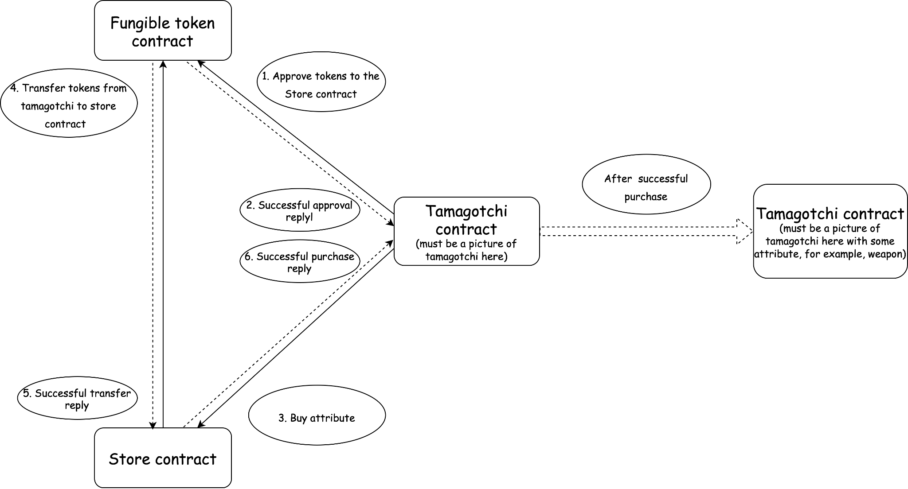
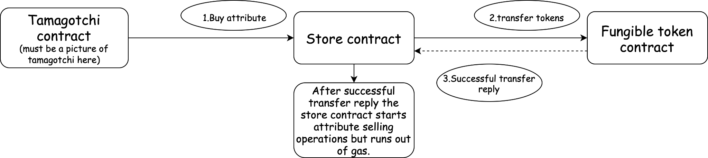

## 第 4 课：Tamagotchi 商店说明

### 课程总结：

- 本课程涵盖如何使用同质化代币创建销售 Tamagotchi 的合约。

- Tamagotchi 可以具有各种属性，例如配饰、服装和武器，这将是我们即将推出的 Tamagotchi 对战游戏所必需的。

- 购买属性，Tamagotchi 的余额中必须有足够的代币，并且它必须批准商店转让其代币的合约。

- 我们将探讨交易处理以及如何处理在执行过程中出现错误的交易。

### 课程目标：

在本课结束时，你会学习到：

- 创建使用同质化代币销售 Tamagotchi 的合约

- 连接同质化代币的概念（来自第 3 课）及其在购买 Tamagotchi 属性中的用途

- 了解如何检查 Tamagotchi 代币余额并批准转移代币的合约。

- 了解如何处理未完成的交易

### 让我们开始吧！

购买过程包括三个步骤：

1. Tamagotchi 向同质化代币合约发送一条消息，以批准商店合约转移其代币；

2. Tamagotchi 向商店合约发送消息，表明它想要购买的属性；

3. 商店合约向同质化代币合约发送一条消息，以将代币转移给自己。如果代币成功转移，商店会将属性添加到 Tamagotchi 属性中。



编码

让我们开始编写智能合约。首先，我们将定义商店合约状态的结构：

```rust
pub struct AttributeStore {
    admin: ActorId,
    ft_contract_id: ActorId,
    attributes: BTreeMap<AttributeId, (Metadata, Price)>,
    owners: BTreeMap<TamagotchiId, BTreeSet<AttributeId>>,
}
```

我们将使用类型别名来提高代码的可读性：

```rust
pub type AttributeId = u32;
pub type Price = u128;
pub type TamagotchiId = ActorId;
```

属性的元数据包含以下字段：

```rust
pub struct Metadata {
    // the attribute title, for example: "Weapon"
    pub title: String,
    // description of the attribute
    pub description: String,
    // URL to associated media (here it should be an attribute picture)
    pub media: String,
}
```

让我们定义商店合约必须执行的操作：

- 合约必须创建新的属性并将它们出售给 Tamagotchi 合约；

- 合约必须接收来自 Tamagotchi 合约的消息。

在实现这些功能之前，我们将定义合约商店的 store-io rust 项目工程并编写 `lib.rs` 文件：

```rust
#![no_std]
use gstd::{prelude::*, ActorId};

pub type AttributeId = u32;
pub type Price = u128;
pub type TamagotchiId = ActorId;
#[derive(Encode, Decode)]
pub struct Metadata {
    // the attribute title, for example: "Weapon"
    pub title: String,
    // description of the attribute
    pub description: String,
    // URL to associated media (here it should be an attribute picture)
    pub media: String,
}

#[derive(Encode, Decode)]
pub enum StoreAction {
	CreateAttribute {
		attribute_id: AttributeId,
		metadata: Metadata,
		price: Price
	},
	BuyAttribute {
		attribute_id: AttributeId,
	}
}

#[derive(Encode, Decode)]
pub enum StoreEvent {
	AttributeCreated {
		attribute_id: AttributeId,
	},
	AttributeSold {
		success: bool,
			},
}

```

商店合约将接受两种类型的消息：`CreateAttribute` 和 `BuyAttribute`。消息执行成功后，它会回复 `AttributeCreated` 或 `AttributeSold`。

然后我们将编写程序的基本结构，代码如下：

```rust

#![no_std]
use gstd::{msg, prelude::*, ActorId};
use store_io::*;

static mut STORE: Option<AttributeStore> = None;

pub struct AttributeStore {
	admin: ActorId,
	ft_contract_id: ActorId,
	attributes: BTreeMap<AttributeId, (Metadata, Price)>
	owners: BTreeMap<TamagotchiId, BTreeSet<AttributeId>)
}

impl AttributeStore {
	fn create_attribute(&mut self, attribute_id: AttributeId, metadata: &Metadata, price: Price) {}
	async fn buy_attribute(&mut self, attribute_id: AttributeId) {}

}

#[gstd::async_main]
async fn main() {
	let action: StoreAction = msg::load().expect("Unable to decode `StoreAction`");

	let store: &mut AttributeStore = unsafe { STORE.get_or_insert(Default::default()) };
	match action {
		StoreAction::CreateAttribute {
			attribute_id,
			metadata,
			price
		} => store.create_attribute(attribute_id, &metadata, price),
		StoreAction::BuyAttribute { attribute_id } => store.buy_attribute(attribute_id).await,
	}
}

#[no_mangle]
unsafe extern "C" fn init() {
	let ft_contract_id: ActorId = msg::load().expect("Unable to decode `ActorId`);
	let store = AttributeStore {
		admin: msg::source(),
		ft_contract_id,
		..Default::default()
	};
	STORE = Some(store);
}
```

`buy_attribute` 函数是异步的，因为商店合约必须向代币合约发送消息并等待它的回复。

现在，让我们实现 `create_attribute` 函数。这个函数很简单，执行以下步骤：

- 验证发送消息的帐户是合约管理员。

- 确保具有指定 ID 的属性不存在。

- 创建一个新属性

- 发送一个回复，指示属性创建成功。

```rust
fn create_attribute(&mut self, attribute_id: AttributeId, metadata: &Metadata, price: Price) {
       assert_eq!(msg::source(), self.admin, "Only admin can add attributes");

       if self
           .attributes
           .insert(attribute_id, (metadata.clone(), price))
           .is_some()
       {
           panic!("Attribute with that ID already exists");
       }

       msg::reply(StoreEvent::AttributeCreated { attribute_id }, 0)
           .expect("Error in sending a reply `StoreEvent::AttributeCreated");
   }
```

接下来，深入了解 `buy_attribute` 函数的实现。正如我们之前讨论的，此函数负责启动从 Tamagotchi 合约到商店合约的代币转移，并且它必须跟踪同质化代币合约中的交易 ID。为此，我们将在商店合约的状态中添加一个名为 transaction_id 的新字段。

因此，商店合约负责跟踪同质化代币中的交易，并且必须考虑其中当前交易的 ID。让我们将字段 transaction_id 添加到合约状态：

```rust
pub struct AttributeStore {
	...
	transaction_id: TransactionId,
}
```

该字段将存储当前交易的 ID，并允许商店合约轻松跟踪代币的转移状态。有了这个字段，buy_attribute 函数可以启动代币转移，跟踪交易的 ID，并等待同质化代币合约的回复以确认转移成功。

我们还在 store-io 中声明交易 ID 的类型：

```rust
pub type TransactionId = u64;
```

接下来，让我们假设以下情况：



1. Tamagotchi 向商店合约发送消息以购买属性；

2. 商店合约向同质化代币合约发送消息，并收到代币转移成功的回复；

3. 商店合约开始改变其状态。它将指示的属性添加到 Tamagotchi 所有权，但耗尽了 gas。

在这种情况下，代币被转移到商店合约，但 Tamagotchi 没有收到它的属性。为防止这种情况，商店合约必须检测交易何时未完成并相应地继续执行。

让我们向 `AttributeStore` 结构添加另一个字段：

```rust
pub struct AttributeStore {
	...
	transaction_id: TransactionId,
	transactions: BTreeMap<TamagotchiId, (TransactionId, AttributeId)>,
}
```

当商店合约收到来自 Tamagotchi 的购买消息时，它会检查 Tamagotchi 是否已经参与任何未完成的交易。

如果 Tamagotchi 有未完成的交易，商店合约会检索与交易关联的交易编号和属性 ID，并恢复交易。

如果之前的消息没有完成，Tamagotchi 必须发送另一条相同的消息来完成交易。但是，Tamagotchi 可能会发送多条购买消息而没有注意到某些消息未通过。

为了处理这个问题，存储合约检查当前消息中指定的属性 ID，并将其与存储在交易中的属性 ID 进行比较。如果保存的 id 不等于指定的 id，则商店合约会要求 Tamagotchi 完成之前的交易。否则，它将继续挂起的交易。

如果 Tamagotchi 没有未决交易，则存储合约会增加 transaction_id 并保存交易。

```rust

async fn buy_attribute(&mut self, attribute_id: AttributeId) {
    let (transaction_id, attribute_id) = if let Some((transaction_id, prev_attribute_id)) =
    self.transactions.get(&msg::source())
    {
        // if `prev_attribute_id` is not equal to `attribute_id` then it means that transaction didn`t completed
        // we ask the Tamagotchi contract to complete the previous transaction
        if attribute_id != *prev_attribute_id {
            msg::reply(
                StoreEvent::CompletePrevTx {attribute_id: *prev_attribute_id,},
                0,
            )
            .expect("Error in sending a reply `StoreEvent::CompletePrevTx`");
               return;
        }
           (*transaction_id, *prev_attribute_id)
       } else {
           let current_transaction_id = self.transaction_id;
           self.transaction_id = self.transaction_id.wrapping_add(1);
           self.transactions
               .insert(msg::source(), (current_transaction_id, attribute_id));
           (current_transaction_id, attribute_id)
       };

       let result = self.sell_attribute(transaction_id, attribute_id).await;
       self.transactions.remove(&msg::source());

      msg::reply(StoreEvent::AttributeSold { success: result }, 0)
           .expect("Error in sending a reply `StoreEvent::AttributeSold`");
  }
```

请注意，你必须将 `CompletePrevTx` 事件添加到 `StoreEvent` 以确保正确的事件跟踪。

编写出售属性的函数。出售属性类似于执行 NFT 转移。我们会将属性 ID 分配给 Tamagotchi 合约。

首先，我们将编写代币转移函数：

```rust
async fn transfer_tokens(
   transaction_id: TransactionId,
   token_address: &ActorId,
   from: &ActorId,
   to: &ActorId,
   amount_tokens: u128,
) -> Result<(), ()> {
   let reply = msg::send_for_reply_as::<_, FTokenEvent>(
       *token_address,
       FTokenAction::Message {
           transaction_id,
           payload: Action::Transfer {
               sender: *from,
               recipient: *to,
               amount: amount_tokens,
           }
           .encode(),
       },
       0,
   )
   .expect("Error in sending a message `FTokenAction::Message`")
   .await;

   match reply {
       Ok(FTokenEvent::Ok) => Ok(()),
       _ => Err(()),
   }
}
```

我们已经向代币合约发送了一条消息并处理了它的回复。只有在收到 `FTokenEvent::Ok` 时，合约才认为发送给代币合约的消息已成功处理。

现在，准备编写出售属性的函数：

```rust
async fn sell_attribute(
       &mut self,
       transaction_id: TransactionId,
       attribute_id: AttributeId,
   ) -> bool {
       let (_, price) = self
           .attributes
           .get(&attribute_id)
           .expect("Can`t get attribute_id");

       if transfer_tokens(
           transaction_id,
           &self.ft_contract_id,
           &msg::source(),
           &exec::program_id(),
           *price,
       )
       .await
       .is_ok()
       {
           self.owners
               .entry(msg::source())
               .and_modify(|attributes| {
                   attributes.insert(attribute_id);
               })
               .or_insert_with(|| [attribute_id].into());
           return true;
       }
```

首先，合约接收到属性价格，然后调用函数 `transfer_tokens`。如果代币转移的结果是成功的，它会将属性添加到 Tamagotchi 合约中。

非常好！我们完成了合约逻辑的编写。

现在，赋予 Tamagotchi 购买属性。

### 我们学到了什么：

- 与同质化代币合约进行通信；

- 如何处理不完整/不完善的交易。

### 课后作业：

- 将代币提供给 Tamagotchi 合约（此处必须是部署在测试网上的同质化代币合约的链接）；

- 向 Tamagotchi 合约添加字段以存储同质化代币合约的地址；

- 添加批准转移其代币的能力（以及相应的用于与同质化代币合约通信的字段 transaction_id）；

- 将函数 buy_attribute 添加到 Tamagotchi 合约中；

- 为 Tamagotchi 天添加购买属性，看看它是如何变化的。

对于与前端一致的合约，元数据必须如下：

```rust
pub struct ProgramMetadata;

impl Metadata for ProgramMetadata {
   type Init = InOut<String, ()>;
   type Handle = InOut<TmgAction, TmgEvent>;
   type Reply = InOut<(), ()>;
   type Others = InOut<(), ()>;
   type Signal = ();
   type State = Tamagotchi;
}

#[derive(Encode, Decode, TypeInfo)]
pub enum TmgAction {
   Name,
   Age,
   Feed,
   Play,
   Sleep,
   Transfer(ActorId),
   Approve(ActorId),
   RevokeApproval,
   ApproveTokens {
       account: ActorId,
       amount: u128,
   },
   SetFTokenContract(ActorId),
   BuyAttribute {
       store_id: ActorId,
       attribute_id: AttributeId,
   },
}

#[derive(Encode, Decode, TypeInfo)]
pub enum TmgEvent {
   Name(String),
   Age(u64),
   Fed,
   Entertained,
   Slept,
   Transfer(ActorId),
   Approve(ActorId),
   RevokeApproval,
   ApproveTokens { account: ActorId, amount: u128 },
   ApprovalError,
   SetFTokenContract,
   AttributeBought(AttributeId),
   CompletePrevPurchase(AttributeId),
   ErrorDuringPurchase,
}
```
