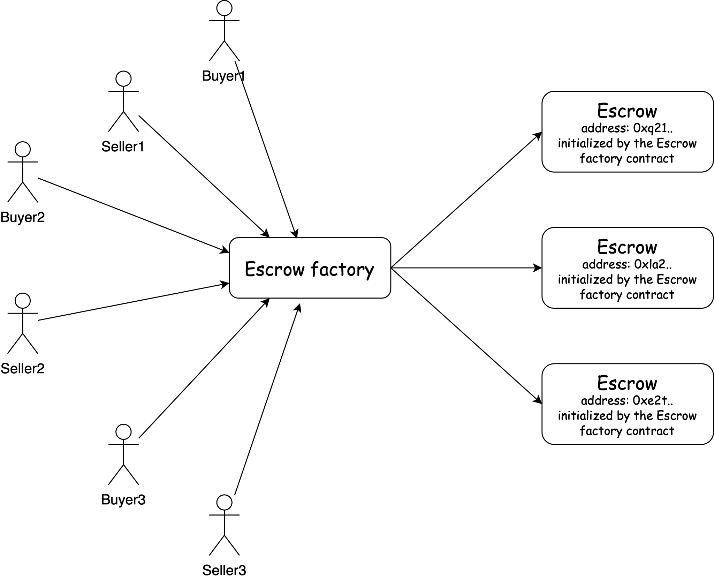
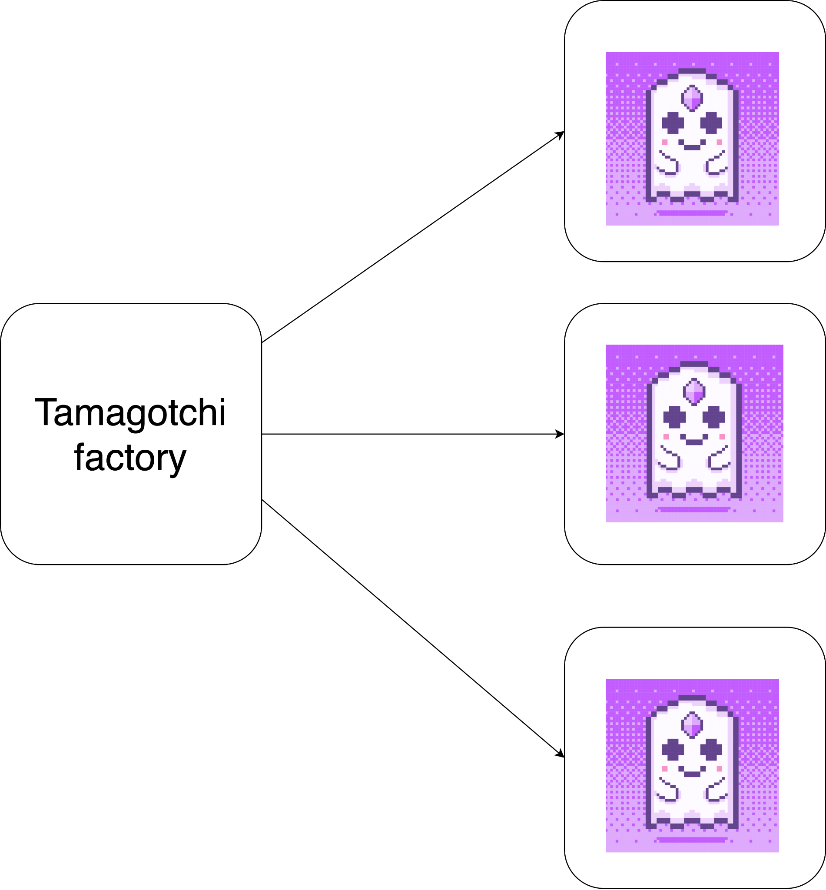

## 第六课：实现多托管智能合约的程序工厂

### 课程总结

- 在之前的 (第 2 课) 教程中，我们创建了一个托管智能合约，促进了双方之间的交互。

- 然而，托管合约在交易结束后变得毫无用处，必须重新初始化才能与新的交易方进行新交易。

- 在本教程中，我们将学习如何编写一个 Escrow Factory 智能合约，以创建上一教程中托管合约模板的多个实例。

- 托管工厂智能合约消除了为每笔新交易上传和初始化相同托管合约模板的需要。

- 最后，我们将通过将托管工厂智能合约部署到区块链并使用该工厂创建多个托管合约实例来测试它。

### 课程目标

在本课结束时，你会学习到：

- 了解如何创建工厂智能合约

- 解释如何使用工厂合约初始化一个新的合约实例

- 演示如何测试工厂智能合约

- 了解工厂合约的概念以及如何使用它来部署合约的新实例。

- 了解如何与 Escrow Factory 合约交互，为不同方创建 Escrow 合约的新实例。

### 让我们开始吧！



#### 创建托管工厂的编码实践

Escrow Factory 将存储创建的托管合约的数量，从托管 ID 到其程序地址的映射，以及托管智能合约的 CodeId:

```rust
#![no_std]
use gstd::{msg, prelude::*, ActorId, CodeId};
pub type EscrowId = u64;

#[derive(Default)]
pub struct EscrowFactory {
    pub escrow_number: EscrowId,
    pub id_to_address: BTreeMap<EscrowId, ActorId>,
    pub escrow_code_id: CodeId,
}
static mut ESCROW_FACTORY: Option<EscrowFactory> = None;

#[gstd::async_main]
async fn main() {}

#[no_mangle]
unsafe extern "C" fn init() {
    let escrow_code_id: CodeId = msg::load().expect("Unable to decode CodeId of the Escrow program");

    let escrow_factory = EscrowFactory {
        escrow_code_id,
        ..Default::default()
    };
    ESCROW_FACTORY = Some(escrow_factory);
}
```

`CodeId` 是上传到链中的托管程序的哈希值。该哈希将用于创建托管智能合约的实例。

让我们定义贷款工厂合约的功能。它将部署托管合约并将有关存款和交付确认的消息发送到托管。

```rust

#[derive(Encode, Decode, TypeInfo)]
pub enum FactoryAction {
   CreateEscrow {
       seller: ActorId,
       buyer: ActorId,
       price: u128,
   },
   Deposit(EscrowId),
   ConfirmDelivery(EscrowId),
}

#[derive(Encode, Decode, TypeInfo)]
pub enum FactoryEvent {
   EscrowCreated {
       escrow_id: EscrowId,
       escrow_address: ActorId,
   },
   Deposited(EscrowId),
   DeliveryConfirmed(EscrowId),
}
```

如你所见，托管合约将通过托管工厂合约与买方和卖方进行交互，这意味着托管工厂合约将向托管合约发送消息。

首先，我们必须为托管合约定义一个名为 io 的 rust 代码工程。然后我们将修改传入消息的结构和托管方法。尝试自己更改它，然后将其与正确的实现（链接）进行比较。

之后，我们将定义贷款工厂方法并编写 `handle` 函数：

```rust
impl EscrowFactory {
   async fn create_escrow(&mut self, seller: &ActorId, buyer: &ActorId, price: u128) {}
   async fn deposit(&self, escrow_id: EscrowId) {}
   async fn confirm_delivery(&self, escrow_id: EscrowId) {}
}

#[gstd::async_main]
async fn main() {
   let action: FactoryAction = msg::load().expect("Unable to decode `FactoryAction`");
   let factory = unsafe { ESCROW_FACTORY.get_or_insert(Default::default()) };
   match action {
       FactoryAction::CreateEscrow {
           seller,
           buyer,
           price,
       } => factory.create_escrow(&seller, &buyer, price).await,
       FactoryAction::Deposit(escrow_id) => factory.deposit(escrow_id).await,
       FactoryAction::ConfirmDelivery(escrow_id) => factory.confirm_delivery(escrow_id).await,
   }
}
```

让我们实现 `create_escrow` 函数。

对于程序部署，我们应该从 `gstd` 库的 `prog` 模块中导入 `ProgramGenerator`：

```rust
use gstd::{msg, prelude::*, ActorId, prog::ProgramGenerator, CodeHash};
```

要创建一个新的合约实例，我们将使用 `create_program_with_gas_for_reply` 函数。以下是必需的参数：

- 上传程序代码的代码哈希

- 初始化消息的有效载荷

- 用于程序创建的 Gas（提前计算网络上加载的程序的初始化需要多少 gas）

- 附加到初始化消息的值

```rust

async fn create_escrow(&mut self, seller: &ActorId, buyer: &ActorId, price: u128) {
    let (address, _) = ProgramGenerator::create_program_with_gas_for_reply(
        self.escrow_code_id,
        InitEscrow {
            seller: *seller,
            buyer: *buyer,
            price,
        }.encode(),
        GAS_FOR_CREATION,
        0,
       )
       .expect("Error during Escrow program initialization")
       .await
       .expect("Program was not initialized");
       self.escrow_number = self.escrow_number.saturating_add(1);
       self.id_to_address.insert(self.escrow_number, address);
       msg::reply(
           FactoryEvent::EscrowCreated {
               escrow_id: self.escrow_number,
               escrow_address: address,
           },
           0,
       )
       .expect("Error during a reply `FactoryEvent::ProgramCreated`");
   }
```

在托管工厂智能合约中，我们使用异步程序创建来确保程序初始化无误。由于工厂程序等待回复，我们在程序初始化中添加一条回复消息。

其他方法很容易实现，因为所有逻辑和所有检查都包含在托管合约中：

```rust
async fn deposit(&self, escrow_id: EscrowId) {
    let escrow_address = self.get_escrow_address(escrow_id);
    send_message(&escrow_address, EscrowAction::Deposit(msg::source())).await;
    msg::reply(FactoryEvent::Deposited(escrow_id), 0)
        .expect("Error during a reply `FactoryEvent::Deposited`");
}

async fn confirm_delivery(&self, escrow_id: EscrowId) {
    let escrow_address = self.get_escrow_address(escrow_id);
    send_message(&escrow_address, EscrowAction::ConfirmDelivery(msg::source())).await;
    msg::reply(FactoryEvent::DeliveryConfirmed(escrow_id), 0)
        .expect("Error during a reply `FactoryEvent::DeliveryConfirmed`");
}

fn get_escrow_address(&self, escrow_id: EscrowId) -> ActorId {
    *self
    .id_to_address
    .get(&escrow_id)
    .expect("The escrow with indicated id does not exist")
}
```

我们将 `msg::send_for_reply_as` 移动到一个单独的函数以将消息发送到 Escrow 程序以提高可读性。

```rust
async fn send_message(escrow_address: &ActorId, escrow_payload: EscrowAction) {
    msg::send_for_reply_as::<_, EscrowEvent>(*escrow_address, escrow_payload, msg::value())
       .expect("Error during a sending message to a Escrow program")
       .await
       .expect("Unable to decode EscrowEvent");
}
```

工厂贷款合约完成后，我们现在将测试我们的工厂合约。

#### 测试托管工厂功能

在测试 Escrow Factory 智能合约之前，我们需要搭建环境。就是这样：

- 上传托管合约的代码：

```rust
use gtest::{Program, System};

#[test]
fn init_escrow_factory() {
   let system = System::new();
   let escrow_code_id = system.submit_code("./escrow/target/wasm32-unknown-unknown/release/escrow.opt.wasm");
   let escrow_factory = Program::current(&system);
   let res = escrow_factory.send(100, escrow_code_id);
   assert!(!res.main_failed());
   assert!(res.log().is_empty());
}
```

继续按照你在之前课程中学到的方法测试合约。

### 任务：

- 完成 Escrow 工厂的测试；

- 编写出一份合约，用你的合约模板创建 Tamagotchi。


