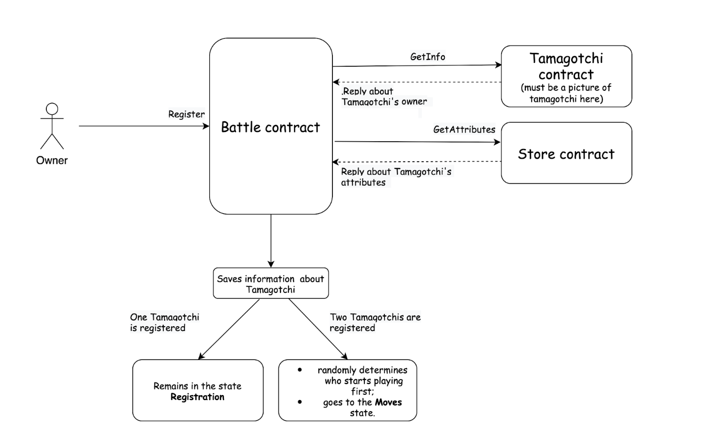
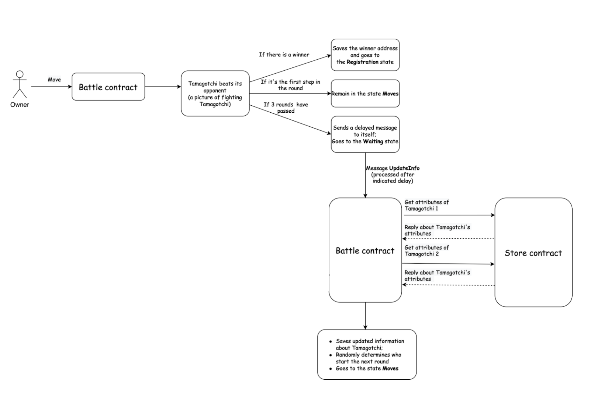

## 第 7 课：Tamagotchi 战斗逻辑与实施

### 课程总结

- 本课的重点是促进两个 Tamagotchi 之间战斗的合约。

- 战斗合约可以处于四种状态之一：Registration、Moves、Waiting 和 GameIsOver。

- Battle 结构包含有关玩家的信息、游戏的当前状态、当前回合、Tamagotchi 商店 ID、获胜者以及到目前为止所走的步数。

- 要参与游戏，用户必须允许他们的合约接收与游戏相关的消息，如 TmgAction::TmgInfo 和 StoreAction::GetAttributes。

- 注册函数从商店获取 Tamagotchi 主人的信息及其属性，随机生成 Tamagotchi 的力量和能量，并注册 Tamagotchi。

- get_owner 和 get_attributes 函数分别从商店中检索有关 Tamagotchi 所有者和属性的信息，而 get_turn 和 generate_power 函数分别生成伪随机数以确定谁开始游戏和 Tamagotchi 的功率。

### 课程目标

在课程结束时，你会学习到：

- 理解促成两个 Tamagotchi 之间战斗的合约。

- 了解 Battle 结构体中包含的信息，例如玩家信息、游戏状态、获胜者和到目前为止所走的步数。

- 领悟战斗合约状态并理解它们的作用

- 了解用于从商店检索信息和生成伪随机数的函数，例如 get_owner、get_attributes、get_turn 和 generate_power。

- 完成 Tamagotchi 对战的简单实现

### 让我们开始吧！

战斗合约可以有 3 种状态：

- `Registration`：战斗合约等待 Tamagotchi 主人注册；

- `Move`：Tamagotchi 所有者轮流移动；

- `Waiting`：在 Tamagotchi 主人采取行动后，战斗合约让他们有时间装备 Tamagotchi。

- `GameIsOver`：战斗结束，需要发送消息`StartNewGame`。

    ```rust
    enum BattleState {
        Registration,
        Moves,
        Waiting,
        GameIsOver,
    }

    impl Default for BattleState {
        fn default() -> Self {
            BattleState::Registration
        }
    }
    ```

战斗程序状态：

```rust
#[derive(Default)]
pub struct Battle {
   players: Vec<Player>,
   state: BattleState,
   current_turn: u8,
   tmg_store_id: ActorId,
   winner: ActorId,
   steps: u8,
}
```

玩家结构如下：

```rust
#[derive(Default)]
pub struct Player {
   owner: ActorId,
   tmg_id: TamagotchiId,
   energy: u16,
   power: u16,
   attributes: BTreeSet<AttributeId>,
}
```

要参与，用户必须允许他们的合约接收与游戏相关的消息，如下所示：

```rust
TmgAction::TmgInfo
```

它将响应有关 Tamagotchi 所有者的信息：
```rust
TmgEvent::Owner(ActorId)
```

我们还将添加消息

```rust
StoreAction::GetAttributes
```

到允许我们获得 Tamagotchi 属性的商店合约

```rust
StoreEvent::Attributes {
	attributes: BTreeSet<AttributeId>
}
```

`register` 方法：

它允许注册两个 Tamagotchi 进行战斗。



1. 在你注册 Tamagotchi 之前，战斗合约必须从商店接收 Tamagotchi 的所有者及其属性；

2. 收到详情后，战斗合约随机生成 Tamagotchi 的力量和能量；

3. 如果一只 Tamagotchi 被注册，它会保持在注册状态；

4. 如果注册了两个 Tamagotchi，战斗合约将随机确定谁先开始游戏并进入 `Moves` 状态。

```rust
async fn register(&mut self, tmg_id: &TamagotchiId) {
    assert_eq!(
        self.state,
        BattleState::Registration,
        "The game has already started"
    );

    let owner = get_owner(tmg_id).await;
    let attributes = get_attributes(&self.tmg_store_id, tmg_id).await;
    let power = generate_power();
    let power = MAX_power - power;
    let player = Player {
        owner,
        tmg_id: *tmg_id,
        energy,
        power,
        attributes,
    };
    self.players.push(player);

    if self.players.len() == 2 {
        self.current_turn = get_turn();
        self.state = BattleState::Moves;
    }

msg::reply(BattleEvent::Registered { tmg_id: *tmg_id }, 0)
        .expect("Error during a reply `BattleEvent::Registered");
   }
```

`get_owner` 函数从 Tamagotchi 合约中检索 Tamagotchi 的所有者。

```rust
pub async fn get_owner(tmg_id: &ActorId) -> ActorId {
   let reply: TmgEvent = msg::send_for_reply_as(*tmg_id, TmgAction::Owner, 0)
       .expect("Error in sending a message `TmgAction::Owner")
       .await
       .expect("Unable to decode TmgEvent");
   if let TmgEvent::Owner(owner) = reply {
       owner
   } else {
       panic!("Wrong received message");
   }
}
```

同样，`get_attributes` 函数从商店中检索 Tamagotchi 的属性。

```rust
async fn get_attributes(tmg_store_id: &ActorId, tmg_id: &TamagotchiId) -> BTreeSet<AttributeId> {
   let reply: StoreEvent = msg::send_for_reply_as(
       *tmg_store_id,
       StoreAction::GetAttributes {
           Tamagotchi_id: *tmg_id,
       },
       0,
   )
   .expect("Error in sending a message `StoreAction::GetAttributes")
   .await
   .expect("Unable to decode `StoreEvent`");
   if let StoreEvent::Attributes { attributes } = reply {
       attributes
   } else {
       panic!("Wrong received message");
   }
}
```

为了确定哪个玩家开始游戏，我们使用 `get_turn` 函数，它使用伪随机算法选择开始玩家：

```rust
pub fn get_turn() -> u8 {
   let random_input: [u8; 32] = array::from_fn(|i| i as u8 + 1);
   let (random, _) = exec::random(random_input).expect("Error in getting random number");
   random[0] % 2
}
```

`genetate_power` 函数使用伪随机算法生成 Tamagotchi 的力量值：

```rust
pub fn genetate_power() -> u16 {
   let random_input: [u8; 32] = array::from_fn(|i| i as u8 + 1);
   let (random, _) = exec::random(random_input).expect("Error in getting random number");
   let bytes: [u8; 2] = [random[0], random[1]];
   let random_power: u16 = u16::from_be_bytes(bytes) % MAX_POWER;
   if random_power < MIN_POWER {
       return MAX_POWER / 2;
   }
   random_power
}
```

还有两个常量 `MAX_POWER` 和 `MIN_POWER`，它们定义了 Tamagotchi 力量的上限和下限：

```rust
const MAX_POWER: u16 = 10_000;
const MIN_POWER: u16 = 3_000;
```

接下来，作为例子，我们将定义一个非常简单的游戏机制：

1. Tamagotchi 所有者只需向战斗合约发送一条消息 `BattleAction::Move` 即可采取行动。在这一步中，Tamagotchi 击败了对手的 Tamagotchi。对手的能量会随着攻击的力量而减少。

2. 现在，Tamagotchi 商店里只有一个属性可以在游戏中使用——一把剑。如果攻击的 Tamagotchi 有剑，其攻击力乘以 SWORD_POWER：`SWORD_POWER * power`，否则 Tamagotchi 的攻击力就是他们的力量。

以后可以通过在商店中添加战斗属性来扩展逻辑，还可以添加 Tamagotchi 在场地上的移动。

3. 如果两个玩家都进行了三步，游戏进入等待状态，玩家可以从商店购买物品来装备他们的 Tamagotchi。经过一段设定的延迟后，Tamagotchis 的状态会更新，下一轮开始。



```rust
fn make_move(&mut self) {
    assert_eq!(
        self.state,
        BattleState::Moves,
        "The game is not in `Moves` state"
    );

    let turn = self.current_turn as usize;
    let next_turn = (( turn + 1 ) % 2)as usize;
    let player = self.players[turn].clone();
    assert_eq!(player.owner,
        msg::source(),
        "You are not in the game or it is not your turn"
    );
    let mut opponent = self.players[next_turn].clone();
    let sword_power = if player.attributes.contains(&SWORD_ID) {
        SWORD_POWER
    } else {
        1
    };

    opponent.energy = opponent.energy.saturating_sub(sword_power * player.power);
    self.players[next_turn] = opponent.clone();
    // check if opponent lost
    if opponent.energy == 0 {
        self.players = Vec::new();
        self.state = BattleState::GameIsOver;
        self.winner = player.tmg_id;
        msg::reply(BattleEvent::GameIsOver, 0)
            .expect("Error in sending a reply `BattleEvent::GameIsOver`");
        return;
    }

    if self.steps <= MAX_STEPS_FOR_ROUND {
        self.steps +=å 1;
        self.current_turn = next_turn as u8;
        msg::reply(BattleEvent::MoveMade, 0)
            .expect("Error in sending a reply `BattleEvent::MoveMade`");
    } else {
        self.state = BattleState::Waiting;
        self.steps = 0;
        msg::send_with_gas_delayed(
            exec::program_id(),
            BattleAction::UpdateInfo,
            GAS_AMOUNT,
            0,
            TIME_FOR_UPDATE,
        )
        .expect("Error in sending a delayed message `BattleAction::UpdateInfo`");
        msg::reply(BattleEvent::GoToWaitingState, 0)
            .expect("Error in sending a reply `BattleEvent::MoveMade`");
    }
}
```

`UpdateInfo` 操作只是更新 Tamagotchi 状态的变化并开始下一轮：

```rust
async fn update_info(&mut self) {
    assert_eq!(
        msg::source(),
        exec::program_id(),
        "Only contract itself can call that action"
    );
    assert_eq!(
        self.state,
        BattleState::Waiting,
        "The contract must be in `Waiting` state"
    );

    for i in 0..2 {
        let player = &mut self.players[i];
        let attributes = get_attributes(&self.tmg_store_id, &player.tmg_id).await;
        player.attributes = attributes;
    }
    self.state = BattleState::Moves;
    self.current_turn = get_turn();
    msg::reply(BattleEvent::InfoUpdated, 0)
        .expect("Error during a reply `BattleEvent::InfoUpdated");
   }
```

至此，Tamagotchi 对战的简单实现就完成了。

你可以尝试与你的 Tamagotchi 一起战斗，或者创建一些电子 Tamagotchi（使用上一课）并让它们战斗（链接到网络应用程序）。

现在是你的课程作业时间。

### 课程作业：

- 为商店合约增加更多的战斗属性；

- 确定这些属性的力量。你还可以添加升级各种属性的机会（这也需要扩展商店合约的逻辑）；

- 允许玩家选择他将在回合中战斗或防御的武器；

- 也可以为 Tamagotchi 添加向左或向右移动的能力；

- 发挥创意并考虑其他可能的方法来使游戏更有趣。
