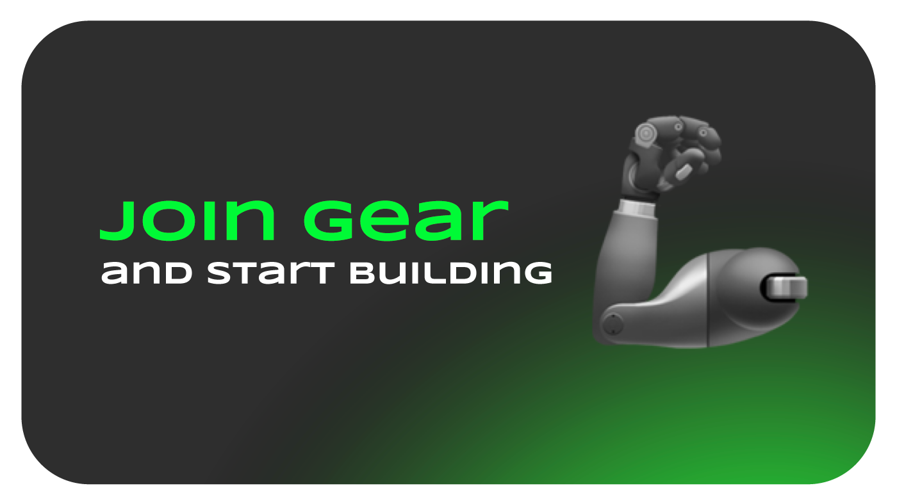

Gear Academy：学习如何成为构建去中心化应用程序的专家

Gear Foundation 很高兴推出其新的教育计划 Gear Academy。“Gear 智能合约开发者”课程是 Gear 的第一个免费课程。该课程深入介绍了如何在 Vara Network 等网络上使用 Rust 开发去中心化应用程序。

通过全面的指导，课程学习者将配置开发环境，从 0 开始构建 dApp，并深入研究 Gear Protocol 所支持的强大功能，例如延迟消息、系统信号和 gas 预留。

该课程由 7 个引人入胜、易于理解的课程章节组成，由浅入深介绍 Gear Protocol 程序开发的功能和细节。

| 课程 | 介绍  |
|---|---|
|  1 | 学习创建和测试你的第一个智能合约程序，了解如何读取程序的状态以检索重要信息。 |
|  2 | 了解托管智能合约以及它们的工作方式。|
|  3 | 了解加密代币——同质化和非同质化（NFT）及其主要功能，包括交易代币的例子。  |
|  4 | 了解不完整交易的处理。 |
|  5 | 获得英式拍卖的分步指南，并学习自动程序执行。 |
|  6 | 理解工厂合约的概念及其在初始化新合约实例中的应用。|
|  7 | 学习阅读其他合约的状态并使用它们的数据，以 Tamagotchi 战斗为特色 - 一对代表虚拟宠物 Tamagthies 互相战斗的智能合约。|

每节课程结束时，课程学习者需要完成一项课后作业并将其上传到平台以供 Gear Academy 讲师审核。整套课程结尾有一个最终项目，该项目会结合整套课程中所讲授的所有知识。在完成全部课程后，学习者将获得证书和纪念 NFT。

**赶快注册 Gear Academy 吧！**

加入 Gear，共同建设！

如果你是生态建设者或开发者，希望利用 Gear Protocol 的独特功能进行去中心化和自动化智能合约开发，请加入 Gear 社区。异步消息调用和 gas 预留支持支持多种开发用例，为区块链生态系统中的用户提供新的去中心化功能和价值。

你可以通过 hello@gear-tech.io 联系 Gear 社区以了解更多信息并开始与 Gear 社区合作。
